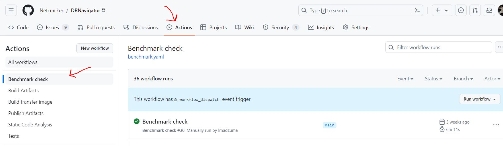
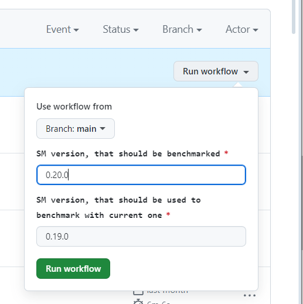
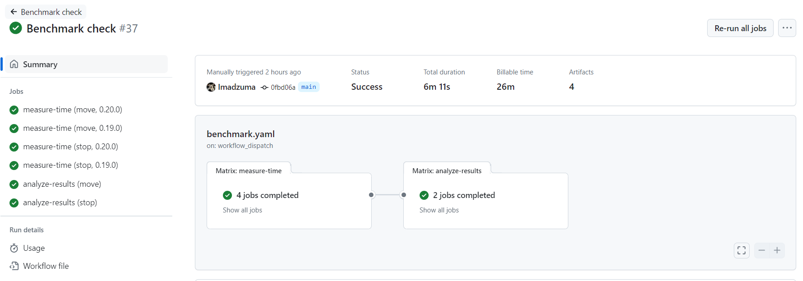

# Benchmark check for site-manager

<!-- TOC -->
* [Benchmark check for site-manager](#benchmark-check-for-site-manager)
  * [Overview](#overview)
  * [How to run benchmark check](#how-to-run-benchmark-check)
<!-- TOC -->

## Overview

Benchmark is a special CI pipeline check, that measures the working time for the most critical site-manager procedures
(switchover and failover), compare this time between different site-manager versions and notify, if the 
delta between them is too big (more than 5%).

To measure the time, site-manager runs with docker-compose with some sm-dummy services.
The configuration of docker-compose and configuration files is available [here](/ci/benchmark).

## How to run benchmark check

Benchmark check is a special GitHub CI pipeline, that runs **only manually**.

To run it you should do following steps:
1. Choose the versions, that you want to compare;
2. Go to the DRNavigator directory on GitHub and open Actions -> Benchmark check;

3. Click on `Run workflow` and choose the following parameters:
    * *Branch*: it is the branch, where benchmark code and configurations are located. Default value: `main`;
    * *SM version, that should be benchmarked*: in common cases it should be new SM version. Default value: `0.20.0`;
    * *SM version, that should be used to benchmark with current one*: in common cases it should be previous SM version. Default value: `0.19.0`;

4. Click `Run workflow button` to run pipeline;

As result new workflow with 6 jobs will be created:

* **measure-time** jobs run first (4 jobs for 2 procedures on 2 SM versions): those jobs run procedures several times 
and check the average working time;
* **analyze-results** jobs run if all **measure-time** jobs are successful (2 jobs for 2 procedures): those jobs compares 
the working time for different procedures and fail if the new version is slower than the old one on 5% or more;
