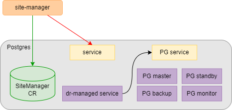
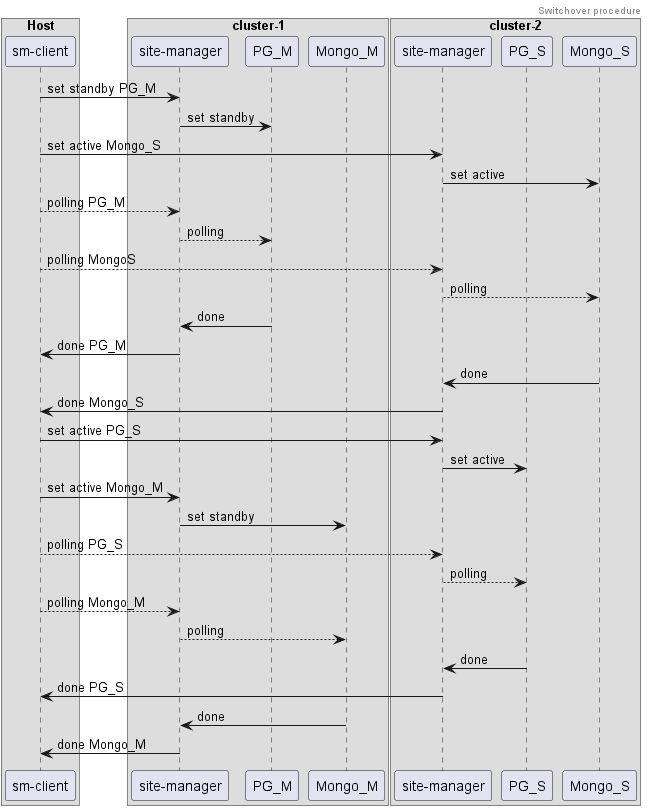
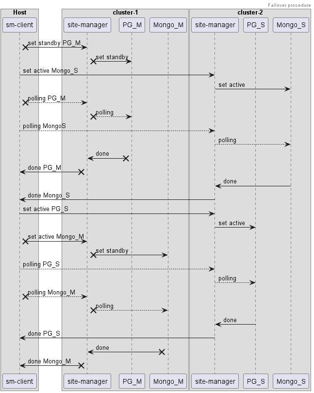
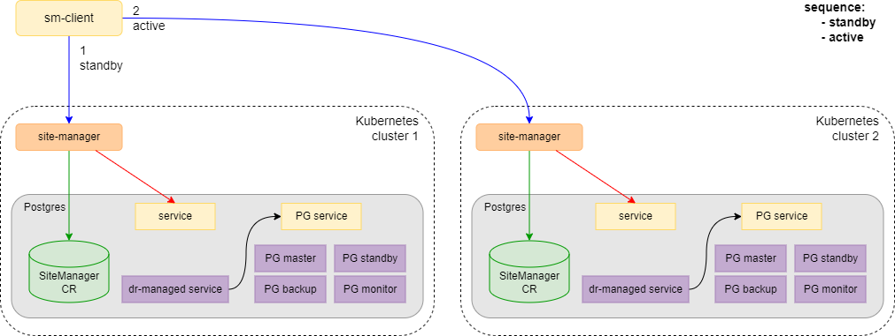
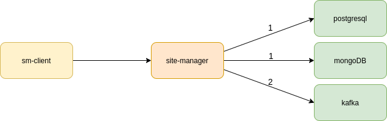
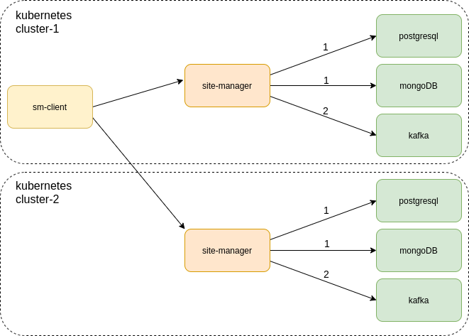
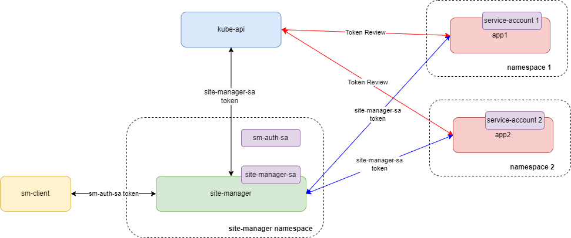
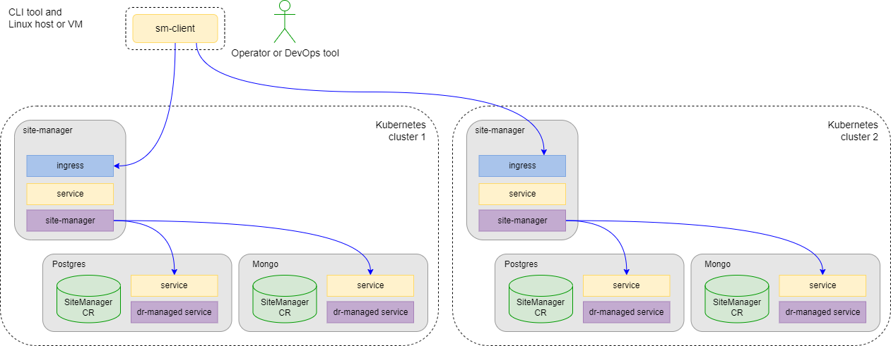

# DR Navigator architecture
<!-- TOC -->
- [Overview](#overview)
- [Managing Services](#managing-services)
- [DR Procedures Flow](#dr-procedures-flow)
  - [Switchover](#switchover)
  - [Failover](#failover)
- [Contract with DR managed services](#contract-with-dr-managed-services)
  - [Custom Resource](#custom-resource)
    - [Service naming](#service-naming)
    - [Service Sequence](#service-sequence)
    - [Service Dependency](#service-dependency)
    - [Service Endpoints](#service-endpoints)
  - [Rest API contract](#rest-api-contract)
    - [API Security Model](#api-security-model)
    - [Check Service Mode and Status of DR Procedure](#check-service-mode-and-status-of-dr-procedure)
    - [Set New Mode for Service](#set-new-mode-for-service)
    - [Check Service Healthz of Service](#check-service-healthz-of-service)
- [Site-manager](#site-manager)
  - [Security. Authorization](#security-authorization)
  - [SiteManager API](#sitemanager-api)
    - [Get dict with all Services and Settings](#get-dict-with-all-services-and-settings)
    - [Check Services Mode and Status of DR Procedure](#check-services-mode-and-status-of-dr-procedure)
    - [Show List of Services](#show-list-of-services)
    - [Start DR Procedure `active`, `standby`, or `disable`](#start-dr-procedure-active-standby-or-disable)
    - [Possible Errors](#possible-errors)
    - [Monitoring metrics](#monitoring-metrics)
- [Sm-client](#sm-client)
  - [Possible Schemes for sm-client and Site-Manager](#possible-schemes-for-sm-client-and-site-manager)
  - [Configuration File](#configuration-file)
  - [Examples of using sm-client](#examples-of-using-sm-client)
  - [State Restrictions](#state-restrictions)
  - [Custom Modules Support](#custom-modules-support)
  - [Dry-run support](#dry-run-support)
- [Paas-geo-monitor](#paas-geo-monitor)
  - [API](#api)
    - [peers status](#peers-status)
    - [Ping](#ping)
    - [Metrics](#metrics)
- [Sm-check](#sm-check)
<!-- /TOC -->

## Overview

The main purpose of DRNavigator is to manage services in a 2-cluster (Kubernetes or OpenShift) environment in the
Active-StandBy scheme.  

The services can be any microservices that implement a special [contract](#contract-with-dr-managed-services);

There are several DR (Disaster Recovery) procedures that can be used. The basic are:

- **Switchover** - swap Active and StandBy roles;
- **Failover** - move Active role to StandBy cluster;

The DRNavigator contains following components:

- `site-manager` - It is the management service to control the DR procedure flow on one cluster;
- `paas-geo-monitor` - it is the optional management service to check connectivity between clusters;
- `sm-client` - It is the client for management of DR procedures in two clusters. It can be launched as a container or
as a cli util;


In a scheme with two clusters, there is `site-manager` that operates in each cluster and `sm-client` that is a client
tool to manage the DR procedures.

## Managing Services

A modular system is implemented that allows different behavior to be applied for different microservices.

The `stateful` module is supported by default. It is intended for services that are fully managed by the special
dr-managed service. This module expands the functionality of dr-managed services. A dr-managed service is an internal
microservice that monitors the state of the service and listens to the HTTP port to receive a REST API for managing the
service DR mode (active or standby). Most of the services have dr-managed services to manage their state, and it is
proposed to expand the functionality for DR cases.



Where:

- `dr-managed service` is a service that manages the life-cycle of a service, such as `postgresql`, `rabbit`, or
`kafka`.
- `SiteManager CR` is the custom resource with description of the DR behavior for a service, specific for the stateful
module.
- `site-manager` is a dedicated service in a separate project. It can set a new state `active` or `standby` to other
services and contains information about all services in the current Kubernetes cluster.

## DR Procedures Flow

### Switchover

Switchover is a special DR procedure, that swaps active and standby roles on sites;
It tries to process services in parallel, if it's possible according their [dependencies](#service-dependency);
For every service it does following:

1. Choose the sites processing order according the [sequence](#service-sequence) of the service;
2. For every site from processing order:  
   2.1. site-manager applies the new role for the service on the site;  
   2.2. site-manager polls the status of the service on the site until the procedure will be done or something will go
wrong;

The service processing result is considered as unsuccessful, if something of following cases occurs:

- Procedure is not done, when polling timeout is reached;
- Procedure is done, but unexpected health is occurred;
- Procedure fails in dr-managed service;  

In that case, switchover procedure does not start new services processing but finishes already started ones;

The following image is an example for two parallel services with different sequence order:  


### Failover

Failover works with services is similar to the switchover procedure. We have only one assumption - standby Kubernetes
cluster can be unavailable. In this case, we should not wait for the correct status. We can omit statuses of all
services of the standby Kubernetes cluster.



## Contract with DR managed services

### Custom Resource

CR SiteManager description:

```yaml
apiVersion: netcracker.com/v3
kind: SiteManager
metadata:
  name: <SERVICE>
  namespace: <NAMESPACE>
  labels:
    app: <SERVICE>
spec:
  sitemanager:
    module: "stateful"
    alias: <OVERRIDEN-SERVICE-NAME>
    after: ["<SERVICE-1>", "<SERVICE-3>"]
    before: ["<SERVICE-5>"]
    sequence: ["standby", "active"]
    timeout: <TIMEOUT-IN-SECONDS>
    allowedStandbyStateList: ["up", "down"]
    parameters:
      serviceEndpoint: "<SERVICENAME>.<NAMESPACE>.svc.cluster.local<:PORT>/sitemanager"
      healthzEndpoint: "<SERVICENAME>.<NAMESPACE>.svc.cluster.local<:PORT>/healthz"
```

Where:

- `module` is the name of the module through which the service should be controlled. This is required parameter;
- `alias` is optional parameter. If it's defined, Site-Manager and sm-client will use specified value of default one.
See [service naming](#service-naming) for details;
- `after` is the list of service names (with namespaces), that should be done before service start. In case of `after`
is empty or absent the service will start among the first services if no service with name of this service in section
`before`. See [service dependency](#service-dependency) for details;
- `before` is the list of service  names (with namespaces), that should wait until service in running. May be empty
or absent. See [service dependency](#service-dependency) for details;
- `sequence` is the order of starting service sides. In case sequence is empty default `["standby","active"]` is used.
See [service sequence](#service-sequence) for details;
- `timeout` is the timeout in seconds for polling operation. If `timeout` is empty or absent site-manager will use
`service_default_timeout` property from sm-client configuration;
- `allowedStandbyStateList` - is the list of possible health statuses for standby site. By default `["up"]`;
- `serviceEndpoint` is the URL to access the dr-managed service. See [service endpoints](#service-endpoints)
for details;
- `healthzEndpoint` is the URL to check service status. See [service endpoints](#service-endpoints)
for details;

Example for `postgres` service:

```yaml
apiVersion: netcracker.com/v3
kind: SiteManager
metadata:
  annotations:
    meta.helm.sh/release-name: postgres-service
    meta.helm.sh/release-namespace: postgres-service
  labels:
    app.kubernetes.io/managed-by: Helm
  name: postgres-service-site-manager
  namespace: postgres-service
spec:
  sitemanager:
    module: "stateful"
    after:
    - paas.paas-namespace
    before: []
    sequence:
    - standby
    - active
    timeout: 360
    parameters:
      serviceEndpoint: postgres-operator.postgres-service.svc.cluster.local:8080/sitemanager
      healthzEndpoint: postgres-operator.postgres-service.svc.cluster.local:8080/health
```

**Important**: Do not read CRs as `v2` version. Only `v3` read (default) is supported.
In v3 version namespaces were additionally supported in service names. In version `v2` after/before dependencies
contains only cr-names, but in `v3` - cr-names + namespaces.
SM automatically convert `v2` CR to `v3`, added namespaces for existed services. But it's recommended to organize
update to `v3` version for used CRs.

#### Service naming

Site-Manager calculates service names for every service to manage them. Rules for calculation:

```text
<cr-name>.<cr-namespace>
```

Site-Manager recognizes service by this name for all operations and dependencies.  
If you **must** use another name (e.g. you have to use different namespaces in different sites), you can override this
name using special section `alias` in CR version v3.

#### Service Sequence

Service sequence is applied when a service should be reconfigured on one Kubernetes cluster before the second Kubernetes
cluster (for example Postgresql cluster), and when `standby` should be performed before `active`.



#### Service Dependency

Often services depend on the sequence of starting other services. For example, `airflow` depends on running the
`postgresql` cluster. To comply with dependencies of services, you can use `after` and `before` parameters.
These parameters are lists and can contain the service names of other services. It is important to understand that we
do not use names of services, we should use names of CRs.

When all dependencies of two or more services are fulfilled, `site-manager` can maintain all these services in parallel.

For one Kubernetes cluster:



For two Kubernetes clusters:



Where:

- `1` is the first set of services.
- `2` is the second set of services. It specifies that the services of that set depend on some services of set `1`.

#### Service Endpoints

To start DR procedures, `site-manager` should send a REST request to the dr-managed service. You should use
`serviceEndpoint` to define the URL for the dr-managed service.  

To check the health status of the current service, `site-manager` checks the URL from `healthzEndpoint`.

### Rest API contract

This section describes which contract must implement the dr-managed services so that the SiteManager can correctly
interact with them.

- [`serviceEndpoint` GET](#check-service-mode-and-status-of-dr-procedure)
- [`serviceEndpoint` POST](#set-new-mode-for-service)
- [`healthzEndpoint` GET](#check-service-healthz-of-service)

#### API Security Model

**Note**: This functionality is enabled by default: `BACK_HTTP_AUTH: "True"` in the Helm chart. This value can later be
changed in the SM deployment.

To implement secure access between SiteManager and dr-managed services, the following special header is added to POST
and GET requests coming from SiteManager:

```yaml
"Authorization": "Bearer <TOKEN>"
```

For the dr-managed service to make sure that the request is secure, on the dr-managed service side, it is necessary to
organize the verification of the token for authenticity and belonging to SiteManager. This is done as follows:

1. Make a request to verify the received token (`TokenReview`) through the `Kubernetes-client` or `Kubectl` of the
following format:

    ```yaml
    apiVersion: authentication.k8s.io/v1
    kind: TokenReview
    spec:
      token: <TOKEN>
    ```

    Where: `<TOKEN>` is a Bearer received from SiteManager `Authorization` request header.
    [Kubernetes-client TokenReview Api for Go](https://github.com/kubernetes-client/go/blob/master/kubernetes/docs/AuthenticationV1Api.md)

2. Kube-api for this request returns a response in the format:

    ```yaml
    apiVersion: authentication.k8s.io/v1
    kind: TokenReview
    spec:
      token: <TOKEN>
    status:
      audiences:
      - <audience identifiers>
      authenticated: true
      user:
        groups:
        -system:serviceaccounts
        -system:serviceaccounts:site-manager
        -system:authenticated
        uid: c1a61275-608e-462e-89df-cf2a8ecc6d13
        username: system:serviceaccount:site-manager:site-manager-sa
    ```

3. In this response, the following fields are relevant:

```yaml
  - status.authenticated = true
  - status.user.username = system:serviceaccount:site-manager:site-manager-sa
```

Where, `site-manager` is the SiteManager's Namespace name and `site-manager-sa` is the SA name.



For more information about a token, see [SiteManager authorization](#security-authorization).

The following parameters are required to implement this approach:

- A dr-managed service that processes requests from SiteManager must have a `serviceaccount`.
- The dr-managed service's `serviceaccount` must be wrapped in a `ClusterRoleBinding` with the `system:auth-delegator`
cluster role:

```yaml
apiVersion: rbac.authorization.k8s.io/v1
kind: ClusterRoleBinding
metadata:
  name: <CRB-NAME>
subjects:
- kind: ServiceAccount
  name: <SERVICE-ACCOUNT-NAME>
  namespace: <NAMESPACE>
roleRef:
  apiGroup: rbac.authorization.k8s.io
  kind: ClusterRole
  name: system:auth-delegator
```

- A handler in the dr-managed service that checks the token for GET and POST requests using `TokenReview` described earlier.

#### Check Service Mode and Status of DR Procedure

**URL**: `<service>.<namespace>.svc.cluster.local/sitemanager`

**Method**: `/GET`

**Code**: 200

**Answer**: `{"mode": "active|standby|disable", "status": queue|running|done|failed", "message": "some string"}`

Where, `mode` is the role of the cluster part, `status` is the current state of the DR procedure, `message` is an
optional field to describe the process details.

The `mode` options are as follows:

- `active` sets the `active` mode for a managed cluster. This mode is for setting the part of the cluster to be
master or main;
- `standby` sets the `standby` mode for a managed cluster. This mode is for setting the part of the cluster to be
slave or backup;
- `disable` sets the `disable` mode for a managed cluster. This mode is for the maintenance procedure to stop the
part of the cluster;

The `status` options are as follows:

- `queue` specifies, that the DR procedure is scheduled, but has not started and current `mode` hasn't changed yet;
- `running` specifies that the DR procedure is in progress;
- `done` specifies that the DR procedure is successfully done. The [healthz](#check-service-healthz-of-service) status
should represent the actual service health check;
- `failed` specifies that the DR procedure has failed. The operator should fix the problem manually or restart the DR
procedure for a specific service;

Example of `/GET` request with `curl` command:

```bash
curl --silent --request GET https://<service>.<namespace>.svc.cluster.local/sitemanager
```

Output:

```json
{"mode":"active","status": "running", "message": "Activation process"}
```

#### Set New Mode for Service

**Important**: The contract between the SiteManager and manageable services for changing the mode implies that the Rest
API of the service has the property of [idempotency](https://restfulapi.net/idempotent-rest-apis/), which means that
changing the mode of the service to an already existing mode does not bring the service into an inconsistent state.
If the service is already moving to the required mode, the response should contain the corresponding mode and the status
equal to `running`.

**URL**: `<service>.<namespace>.svc.cluster.local/sitemanager`

**Method**: `/POST`

**Code**:    200

**Data Params**: `{"mode": "active|standby|disable", "no-wait": True|False}`

Where:

- `active` sets the `active` mode for a managed cluster. This mode is for setting the part of the cluster to be master
or main;
- `standby` sets the `standby` mode for a managed cluster. This mode is for setting the part of the cluster to be
slave or backup;
- `disable` sets the `disable` mode for a managed cluster. This mode is for the maintenance procedure to stop the part
of the cluster;
- `no-wait` specifies a special flag for a microservice to show the type of replication between the parts of a
database cluster. `no-wait=True` specifies that the master member of the cluster should not wait for replication with
the slave member. `no-wait=False` corresponds to only switchover the DR operation. All other procedures occur with the
flag `no-wait=True`;

Example of `/POST` request with `curl` command:

```bash
curl --silent --request POST \
      --header "Content-Type: application/json" \
      --data '{"mode":"active"}' \
      http://<service>.<namespace>.svc.cluster.local/sitemanager
```

Output:

```json
{"mode":"active","status": "running"}
```

#### Check Service Healthz of Service

**URL**: `<service>.<namespace>.svc.cluster.local/healthz`

**Method**: `/GET`

**Code**: 200

**Answer**: `{"status": "up|down|degraded"}`

Where:

- `status` is the current status of the service:
  - `up` specifies that the service is correctly working;
  - `down` specifies that the service is broken;
  - `degraded` specifies that the service is partially broken;

Example of `/GET` request with `curl` command:

```bash
curl --silent --request GET http://<service>.<namespace>.svc.cluster.local/healthz
```

Output:

```json
{"status":"up"}
```

## Site-manager

### Security. Authorization

To restrict access to `site-manager` from `sm-client`, there is a scheme for using authorization by Bearer Token:

1. In the Kubernetes cluster, the `sm-auth-sa` service-account is available without any grants in the same namespace as
`site-manager`;
2. `site-manager` is started with the `FRONT_HTTP_AUTH` env parameter  with value "True";
3. The user fills config.yml for `sm-client` with the same token and sets the `FRONT_HTTP_AUTH` env parameter with value
"True";
4. All REST operations between `sm-client` and `site-manager` contain the "Authorization: Bearer <TOKEN>" header, where,
`TOKEN` is the token from service-account `sm-auth-sa`;
5. When `site-manager` receives the request, it firstly checks the token from authorization header. For that it uses
`Token review` mechanism like dr-managed services, but compares it with `sm-auth-sa` service account instead of 
`site-manager-sa`. See [API Security Model](#api-security-model) for more details. 

To secure access to manageable services from `site-manager`, the same scheme is also added for using authorization by
Bearer Token:

1. The value of the `BACK_HTTP_AUTH` env variable specifies whether the token from the `site-manager-sa` service-account 
is sent to manageable services in the header;
2. The token from `site-manager-sa` is delivered to `site-manager` using 
[token-projection mechanism](https://kubernetes.io/docs/tasks/configure-pod-container/configure-service-account/#serviceaccount-token-volume-projection);
2. For more information about this scheme, see [API Security Model](#api-security-model);

**Note**: `site-manager` is installed by default with `FRONT_HTTP_AUTH` "True" and `BACK_HTTP_AUTH` "True", which means
that authorization is enabled by default;

### SiteManager API

This section describes what requests a SiteManager can respond to on both Kubernetes clusters.

- [SiteManager GET](#get-dict-with-all-services-and-settings)
- [SiteManager POST `{"procedure": "status"}`](#check-services-mode-and-status-of-dr-procedure)
- [SiteManager POST `{"procedure": "list"}`](#show-list-of-services)
- [SiteManager POST `{"procedure": "active|standby|disable"}`](#start-dr-procedure-active-standby-or-disable)
- [Possible errors](#possible-errors)
- [Monitoring metrics](#monitoring-metrics)

#### Get dict with all Services and Settings

**URL**: `site-manager.example.com/sitemanager`

**Method**: `/GET`

**Code**: 200

**Answer**:

```json
{
  "services": {
    "service.namespace": {
      "after": ["service1", "service2"], 
      "allowedStandbyStateList": ["up|down|degraded"],
      "before": ["service1", "service2"], 
      "module": "module name", 
      "CRname": "cr-name",
      "namespace": "cr-namespace", 
      "parameters": {
        "healthzEndpoint": "http://service.namespace.svc.cluster.local:8068/healthz", 
        "serviceEndpoint": "http://service.namespace.svc.cluster.local:8068/sitemanager"
      },
      "sequence": [
        "active", 
        "standby"
      ],  
      "timeout": 360
    }
  }
}
```

This dict compiles CRs of all services managed by `site-manager` and contains all necessary parameters and default
values.

Example of `/GET` request with `curl` command:

```bash
curl --silent --request GET https://site-manager.example.com/sitemanager
```

Output:

```json
{
  "services": {
    "kafka.kafka-service": {
      "after": [], 
      "allowedStandbyStateList": [
        "up"
      ],
      "before": [], 
      "module": "stateful",
      "СRname": "kafka",
      "namespace": "kafka-service", 
      "parameters": {
        "healthzEndpoint": "http://kafka-disaster-recovery.kafka-service.svc.cluster.local:8068/healthz", 
        "serviceEndpoint": "http://kafka-disaster-recovery.kafka-service.svc.cluster.local:8068/sitemanager"
      },
      "sequence": [
        "active", 
        "standby"
      ],  
      "timeout": 360
    },
    "spark-operator-gcp-site-manager": {
      "alias:": "spark-operator-gcp-site-manager",
      "after": [
        "paas.paas-namespace"
      ],
      "allowedStandbyStateList": [
        "up"
      ],
      "before": [],
      "module": "stateful",
      "CRname": "spark-operator-gcp-site-manager",
      "namespace": "spark-operator-gcp", 
      "parameters": {
        "healthzEndpoint": "http://spark-site-manager.spark-operator-gcp.svc.cluster.local:8080/health", 
        "serviceEndpoint": "http://spark-site-manager.spark-operator-gcp.svc.cluster.local:8080/sitemanager"
      },
      "sequence": [
        "standby", 
        "active"
      ],  
      "timeout": 120
    }
  }
}
```

#### Check Services Mode and Status of DR Procedure

**URL**: `site-manager.example.com/sitemanager`

**Method**: `/POST`

**Code**: 200

**Data Params**: `{"procedure": "status", "run-service": "service-name.service-namespace, "with_deps": true/false"}`

**Answer**:

```json
{
  "services": {
    "service-name.service-namespace": {
      "healthz": "up|down|degraded", 
      "message": "some-message", 
      "mode": "active|standby|disable", 
      "status": "running|done|failed", 
      "deps": {
        "before": "<before-services>", 
        "after": "<after-services>"
      }
    }
  }
}
```

This command shows the current status of DR procedures and results of health checks. `with_deps` option are optional
(default value is `false`).
If it's enabled, site-manager will return information about statuses of dependent services in `deps` section.

Example of `/sitemanager` request with `curl` command shows output for service `paas`:

- without `with_deps`:

```bash
curl -XPOST --header "Content-Type: application/json" \
       -d '{"procedure":"status", "run-service": "paas.paas-namespace"}' \
       http://site-manager.example.com/sitemanager
```

Output:

```json
{
  "services": { 
    "paas.paas-namespace": {
          "healthz": "--", 
          "message": "",
          "mode": "active", 
          "status": "done"
    }
  }
}
```

- with`with_deps=true`:

```bash
curl -XPOST --header "Content-Type: application/json" \
       -d '{"procedure":"status", "run-service": "paas.paas-namespace", "with_deps": true}' \
       http://site-manager.example.com/sitemanager
```

Output:

```json
{
  "services": {
    "paas.paas-namespace": {
      "healthz": "--",
      "message": "",
      "mode": "active",
      "status": "done",
      "deps": {
        "before": [
          "service-before-paas.some-namespace"
        ],
        "after": [
          "service-after-paas.some-namespace"
        ]
      }
    },
    "service-after-paas.some-namespace": {
      "healthz": "--",
      "message": "",
      "mode": "active",
      "status": "done",
      "deps": {
        "before": [],
        "after": []
      }
    },
    "service-before-paas.some-namespace": {
      "healthz": "--",
      "message": "",
      "mode": "active",
      "status": "done",
      "deps": {
        "before": [],
        "after": []
      }
    }
  }
}
```

#### Show List of Services

**URL**: `site-manager.example.com/sitemanager`

**Method**: `/POST`

**Code**: 200

**Data Params**: `{"procedure": "list"}`

**Answer**: `{"all_services": ["service-1.service-1-ns", "service-2.service-2-ns"]}`

Example:

```bash
curl -XPOST --header "Content-Type: application/json" \
       -d '{"procedure":"list"}' \
       http://site-manager.k8s-1.openshift.sdntest.netcracker.com/sitemanager
```

Output:

```json
{
  "all-services": [
    "postgres.postres-ns",
    "paas.paas-ns", 
    "kafka.kafka.ns", 
    "mongo.mongo.ns", 
    "streaming-platform.streaming-platform-ns", 
    "paas-1.paas-1-ns", 
    "spark-operator-gcp-site-manager.spark-ns"
  ]
}
```

#### Start DR Procedure `active`, `standby`, or `disable`

**URL**: `site-manager.example.com/sitemanager`

**Method**: `/POST`

**Code**: 200

**Data Params**: `{"procedure": "active|standby|disable", "run-service": "paas.paas-ns"}`

**Answer**: `{"message": "Procedure active is started", "procedure": "active", "service": "paas.paas-ns"}`

This command performs the specified procedure for the selected service.

Example:

```bash
curl -XPOST --header "Content-Type: application/json" \
       -d '{"procedure":"active", "run-service": "paas.paas-ns"}' \
       http://site-manager.example.com/sitemanager
```

Output:

```json
{
  "message": "Procedure active is started", 
  "procedure": "active", 
  "service": "paas.paas-ns"
}
```

#### Possible Errors

1. Incorrect json

    ```bash
    curl -XPOST --header "Content-Type: application/json" \
          -d '{"procedure":"status", "run-service": }' \
          http://site-manager.example.com/sitemanager
    ```

    Output:

    ```json
    {
      "message": "No valid JSON data was received"
    }
    ```

    HTTP Code: 400

2. Wrong procedure

    ```bash
    curl -XPOST --header "Content-Type: application/json" \
          -d '{"procedure":"wrong", "run-service": "paas.paas-ns"}' \
          http://site-manager.example.com/sitemanager
    ```

    Output:

    ```json
    {
      "message": "You should define procedure from list: ['active', 'standby', 'disable', 'list', 'status']"
    }
    ```

    HTTP Code: 400

3. run-service not defined or defined as a non-string type

    ```bash
    curl -XPOST --header "Content-Type: application/json" \
          -d '{"procedure":"active"}' \
          http://site-manager.example.com/sitemanager
    ```

    Output:

    ```json
    {
      "message": "run-service value should be defined and have String type"
    }
    ```

    HTTP Code: 400

4. Tried to start procedure with an incorrect service

    ```bash
    curl -XPOST --header "Content-Type: application/json" \
          -d '{"procedure":"active", "run-service": "wrong-service"}' \
          http://site-manager.example.com/sitemanager
    ```

    Output:

    ```json
    {
        "message": "You defined service that does not exist in cluster",
        "wrong-service": "wrong-service"
    }

    ```

    HTTP Code: 400

5. Try to start status procedure with `with_deps=true` when needed service contains non-existent dependency:

```bash
$ curl -XPOST --header "Content-Type: application/json" \
       -d '{"procedure":"status", "run-service": "some-service.namespace", "with_deps": true}' \
       http://site-manager.example.com/sitemanager
```

Output:

```json
{
  "message": "Dependency defined in CR doesn't exist",
  "wrong-service": "non-existed service",
  "problem-cr": "some-service.namespace"
}
```

HTTP Code: 400

#### Monitoring metrics

Metrics can be checked by running `site-manager` and using the `/metrics` endpoint. The output has Prometheus specific
format and is intended for an external monitoring system.

```bash
curl   --silent --request GET \
       https://site-manager.example.com/metrics
```

## Sm-client

`sm-client` is a cli tool to manage DR procedures between services that are deployed in two Kubernetes clusters. It can
be started on any Linux host with installed python dependencies. Another option is to start `sm-client` in a docker
container. In this case, `sm-client` can work even in the Kubernetes cluster if needed.

The main idea of `sm-client` is to control the sequence of DR procedures for every service for both Kubernetes clusters.
It reads CRs with type SiteManager in Kubernetes clusters and creates a tree with the correct order of services.
`sm-client` waits for successful finish of every DR procedure and starts the next.

`sm-client` help section:

```bash
./sm-client --help
usage: sm-client [-h] [-v] [-c CONFIG] [-f] [-k] [-o OUTPUT] [-r]
                 [--run-services RUN_SERVICES] [--skip-services SKIP_SERVICES]
                 [--dry-run]
                 {move,stop,return,disable,active,standby,list,status,version}
                 ...

Script to manage DR cases in kubernetes Active-Standby scheme

How to use commands:

  +------------------------------+        +------------------------------+
  |      INITIAL CONDITION       |        |        FINAL CONDITION       |
  +--------------+---------------+--------+--------------+---------------+-----+---------+
  | ACTIVE SITE  | STANDBY SITE  |  ===>  | ACTIVE SITE  | STANDBY SITE  |     | COMMAND |
  +--------------+---------------+  ===>  +--------------+---------------+     +---------+
  | ACTIVE       | STANDBY       |  ===>  | STANDBY      | ACTIVE        |  =  | move    |
  | failed       | STANDBY       |  ===>  | stopped      | ACTIVE        |  =  | stop    |
  | stopped      | ACTIVE        |  ===>  | STANDBY      | ACTIVE        |  =  | return  |
  | ACTIVE       | stopped       |  ===>  | ACTIVE       | STANDBY       |  =  | return  |
  | ACTIVE       | STANDBY       |  ===>  | ACTIVE       | stopped       |  =  | disable |
  +--------------+---------------+--------+--------------+---------------+-----+---------+

positional arguments:
  {move,stop,return,disable,active,standby,list,status,version}
    move                move Active functionality to Standby site
    stop                excludes site from Active-Standby scheme
    return              return stopped Kubernetes cluster to Standby role
    disable             stop Standby kubernetes cluster for maintenance
    active              set kubernetes cluster services to active mode
    standby             set kubernetes cluster services to standby mode
    list                list all services from Active-Standby scheme managed by site-manager with dependencies
    status              show current status of clusters and all services
    version             get current version

options:
  -h, --help            show this help message and exit
  -v, --verbose         enable the verbosity mode
  -c CONFIG, --config CONFIG
                        define the path to configuration file
  -f, --force           force apply DR action and ignore healthz
  -k, --insecure        enable self-signed certificates
  -o OUTPUT, --output OUTPUT
                        define the filename for logging output
  -r, --ignore-restrictions
                        skip state restrictions validation
  --run-services RUN_SERVICES
                        define the list of services to apply DR action, by default all services participate
  --skip-services SKIP_SERVICES
                        define the list of services what will not participate in DR action
  --dry-run             perform a dry run without actually executing the operation
```

Where:

- `move site` is the action for **switchover**. Both sites are working, and you need to switch an active site to new.
The site in command is `active` after the action is applied;
- `stop site` is the action for **failover**. This command is used when an `active` site has failed. The site in
command is `standby` after the action is applied;
- `return site` is the action for switching on a `standby` site after a failover. The site in command is `standby`
after the action is applied. This action is applied to only one site;
- `disable site` is the action to switch microservices of a site to the `disable` mode. The site in command is
`disable` after the action is applied. This action is applied to only one site;
- `active site` is the action to switch a site to the `active` mode. This action is applied to only one site.
- `standby site` is the action to switch a site to the `standby` mode. This action is applied to only one site.
- `list` is the action to list all or a part of the microservices of sites.
- `status` is the action to show all or a part of the microservices' status and print them in the list ordered by
dependencies;

### Possible Schemes for sm-client and Site-Manager

1. Run `sm-client` as a cli util on any Linux host with access to both Kubernetes clusters:

    

    `sm-client` starts as a cli util by an operator and prepares the DR procedure for Kubernetes clusters. All logs
are in stdout and `sm-client` shows all operations in runtime. The `sm-client` exits after finishing the DR procedure.

2. Run `sm-client` as a service in the docker container on any container environment and send commands by REST:

    

    `sm-client` runs as a service in the Docker container and can receive REST queries with commands. All procedures
occur in runtime. `sm-client` does not exit after all DR procedures are finished and continues to listen for new REST
queries. `sm-client` can be started on VM or host machine. To achieve HA, the `sm-client` can be started on few nodes,
but only one should launch DR procedures at a time.

### Configuration File

The main configuration file for `sm-client` in a short format looks like the following:

```yaml
---
sites:
  - name: k8s-1
    token: "some token"
    site-manager: http://site-manager.k8s-1.example.com/sitemanager
    cacert: <path-to-ca-certificate>
  - name: k8s-2
    token: 
      from_env: SOME_SM_TOKEN_ENV
    site-manager: http://site-manager.k8s-2.example.com/sitemanager
    cacert: <path-to-ca-certificate>

sm-client:
  http_auth: True
  service_default_timeout: 360
  get_request_timeout: 10
  post_request_timeout: 30
```

Where:

- `sites` is the list of Kubernetes clusters;
- `name` is the short name of a cluster;
- `token` is the token to have access to `site-manager` in a Kubernetes cluster. It can have value with string type
(like for `k8s-1` in example above) or contains `from_env` field with environment variable, where token is collected
(like for `k8s-2`in example above);
- `cacert` is the path to the CA certificate for `site-manager` with a self-signed certificate;
- `http_auth` specifies to use a token for `site-manager` authorization;
- `service_default_timeout` is optional parameter, that specifies default timeout for polling services in seconds.
Default value is 200;
- `get_request_timeout` is optional parameter, that specifies timeout for GET requests to site-manager.
Default value is 10;
- `post_request_timeout` is optional parameter, that specifies timeout for POST requests to site-manager.
Default value is 30;

### Examples of using sm-client

Failover of cluster k8s-1:

```bash
./sm-client stop k8s-1

...
---------------------------------------------------------------------
Summary:
services that successfully done: ['sm-test.sm-test-ns', 'paas.paas-ns', 'postgres.postgres-ns', 'mongo.mongo-ns']
services that failed: []
services that ignored: []
---------------------------------------------------------------------
```

Switchover to cluster k8s-1:

```bash
./sm-client move k8s-1

...
---------------------------------------------------------------------
Summary:
services that successfully done: ['sm-test.sm-test-ns', 'paas.paas-ns', 'postgres.postgres-ns', 'mongo.mongo-ns']
services that failed: []
services that ignored: []
---------------------------------------------------------------------
```

Switchover to cluster k8s-1 with skipping paas and mongo services:

```bash
./sm-client --skip-services paas.paas-ns,mongo.mongo-ns move k8s-1

---------------------------------------------------------------------
Procedure: move

Active site is: k8s-1
Standby site is: k8s-2

Kubernetes services managed by site-manager: ['sm-test.sm-test-ns', 'paas.paas-ns', 'postgres.postgres-ns', 'mongo.mongo-ns']
kubernetes services that will be processed: ['sm-test.sm-test-ns', 'postgres.postgres-ns']
---------------------------------------------------------------------

......

---------------------------------------------------------------------
Summary:
services that successfully done: ['sm-test.sm-test-ns', 'postgres.postgres-ns']
services that failed: []
services that ignored: ['paas.paas-ns', 'mongo.mongo-ns']
---------------------------------------------------------------------
```

Stop standby cluster k8s-1 for maintenance:

```bash
./sm-client disable k8s-1
```

Check status of services:

```bash
$ ./sm-client status

+---------------------------------------------+--------------------------------------+--------------------------------------+
| Service                                     |        k8s-1                         |         k8s-2                        |
+---------------------------------------------+--------------------------------------+--------------------------------------+
|                                             | mode | DR status | healthz | message | mode | DR status | healthz | message |
|   --------------------------------------    |      --------------------------      |      --------------------------      |
| postgres-service-site-manager.postgres-ns   | standby / done / up / --             |  active / done / up / --             |
| kafka.kafka-ns                              | standby / done / up / some kafka msg |  active / done / up / some kafka msg |
| paas.paas-ns                                | standby / done / up / some paas msg  |  active / done / up / some paas msg  |
+---------------------------------------------+--------------------------------------+--------------------------------------+
```

Show list of services in Kubernetes clusters with CR SiteManager:

```shell
./sm-client list

---------------------------------------------------------------------
Kubernetes services managed by site-manager: ['postgres.postgres-ns', 'sm-test.sm-test-ns', 'mongo.mongo-ns', 'paas.paas-ns']
kubernetes services that will be processed: ['postgres.postgres-ns', 'sm-test.sm-test-ns', 'mongo.mongo-ns', 'paas.paas-ns']
---------------------------------------------------------------------
```

### State Restrictions

It is possible to mark some DR cluster states as restricted. This means that such states cannot be the final state for a
service after atomic procedures (`active`, `standby`, `disable`, `return`).  
State restrictions are configured in the sm-client configuration file in a special `restrictions` option:

```yaml
---
sites:
  - name: k8s-1
    token: <TOKEN>
    site-manager: http://site-manager.k8s-1.example.com/sitemanager
    cacert: <path-to-ca-certificate>
  - name: k8s-2
    token: <TOKEN>
    site-manager: http://site-manager.k8s-2.example.com/sitemanager
    cacert: <path-to-ca-certificate>
sm-client:
  http_auth: True
  
restrictions:
  service-1.service-1-ns:
    - active-active
  service-2.service-2-ns:
    - disable-standby
    - standby-disable
  "*":
    - standby-standby
```

In this section, you can describe services and states list for them. The format of the state is
`<mode in first site>-<mode in second site>`. Also, you can add a restricted state for all services by using `"*"`
instead of the service name.  
Before performing the procedure, the final cluster states are predicted for all services described in `restrictions`.
If the predicted state is restricted for any of them, sm-client fails.  
You can run the procedure despite the validation result of restrictions by using a special option `-r` or
`--ignore-restrictions`.

### Custom Modules Support

It is possible to make a custom DR flow (Switchover/Failover; Active/Standby/Disable) sequence based on the
[module of DR service](#managing-services).

```yaml
spec:
  sitemanager:
    module: "custom_module"
```

Optional section ```flow``` needs to be provided.
It describes the sequence of modules with appropriate DR states which needs to be run during DR operation.  
For example:

```yaml
---
sites:
  - name: k8s-1
    token: <TOKEN>
    site-manager: http://site-manager.k8s-1.example.com/sitemanager
    cacert: <path-to-ca-certificate>
  - name: k8s-2
    token: <TOKEN>
    site-manager: http://site-manager.k8s-2.example.com/sitemanager
    cacert: <path-to-ca-certificate>
sm-client:
  http_auth: True
  
flow:
  - custom_module: [standby,disable]
  - stateful:
  - custom_module: [active]
```

The above example implies the following DR sequences:

- Switchover

1. Standby all `custom_module` services
2. Standby, Active for all `stateful` services, according to the [DR sequence](#dr-procedures-flow)
3. Active all `custom_module` services

- Failover

1. Standby, Active `stateful` services
2. Active `custom_module` services

- Active

1. Active `stateful` services
2. Active `custom_module` services

- Standby

1. Standby `custom_module` services
2. Standby `stateful` services

- Disable

1. Disable `custom_module` services
2. Disable `stateful` services

**Note**: The `stateful` module is default. It should not be specified in the config in case of no custom modules.

### Dry-run support

Dry-run mode can be enabled for any procedure in sm-client using `--dry-run` option.
In that case, sm-client does only read-only requests to site-manager (e.g. to get services statuses) and validate, if
specified procedure can be executed without running real processing.

## Paas-geo-monitor

Paas-geo-monitor is a service for monitoring connectivity between geographically distributed clusters.
The primary focus is to check following aspects:

1. DNS resolving for service names from another cluster;
2. Pod-to-service connectivity between clusters;
3. Pod-to-pod connectivity between clusters;

The service should be deployed in each cluster in a schema. Each instance should be able to discover other instances
(peers) in other clusters, so each instance should be provided with a special configuration, containing service names
of the peers.

Each instance reports connectivity status for the current cluster only. So, to gather information about all clusters,
you should contact each instance.

### API

The service provides following HTTP APIs.

#### peers status

peers status endpoint:

- Path: `/peers/status`
- Method: `GET`

The endpoint returns information about DNS, pod-to-pod and pod-to-service statuses of all peers.
An example response:

```yaml
- name: cluster-2
  clusterIpStatus:
    name: paas-geo-monitor.ns.svc.cluster-2.local
    svcPort: 8080
    podPort: 8080
    protocol: http
    dnsStatus:
      resolved: false
      error: 'failed to resolve peer: unable to resolve name dr-monitor.ns.svc.cluster-2.local: lookup dr-monitor.ns.svc.cluster-2.local: no such host'
- name: cluster-3
  clusterIpStatus:
    name: dr-monitor.ns.svc.cluster-3.local
    svcPort: 8080
    podPort: 8080
    protocol: http
    dnsStatus:
      resolved: true
    svcStatus:
      available: true
      address: 1.1.1.1
    podStatus:
      available: true
      address: 2.2.2.2
```

#### Ping

Ping endpoint:

- Path: `/ping`
- Method: `GET`

The endpoint returns IP address of the instance, which is then used to verify pod-to-pod connectivity.
The IP address is taken from `PING_IP` env variable.

#### Metrics

Ping endpoint:

- Path: `/metrics`
- Method: `GET`

The output has Prometheus specific format and is intended for an external monitoring system.

## Sm-check

`sm-check` is a [container image](https://github.com/Netcracker/DRNavigator/pkgs/container/sm-check) with a set of tools to check network connectivity between geographically distributed clusters (DR) on IaaS level. It could be used for [IPIP protocol connectivity check](https://github.com/Netcracker/KubeMarine/blob/main/documentation/Kubecheck.md#017-ip-in-ip-encapsulation) and TCP ports connectivity check. Installation is manual and required on each DR site.
